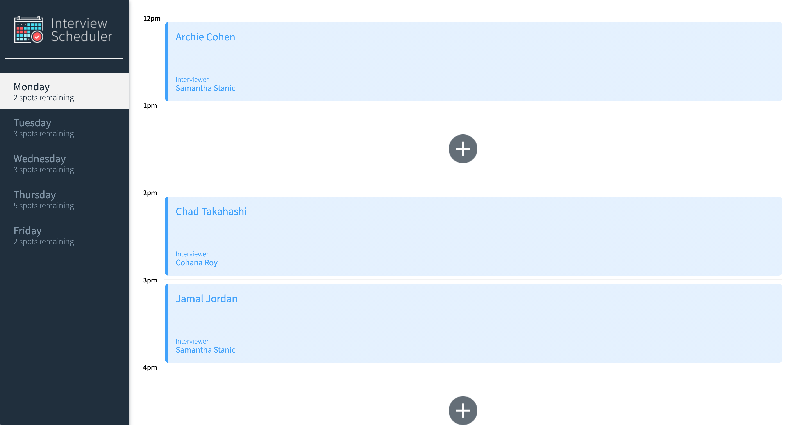
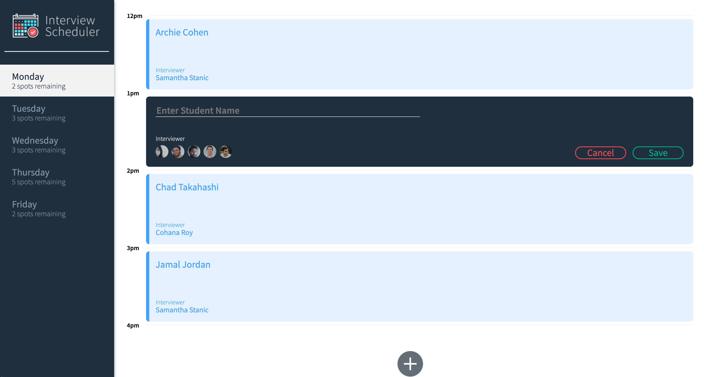
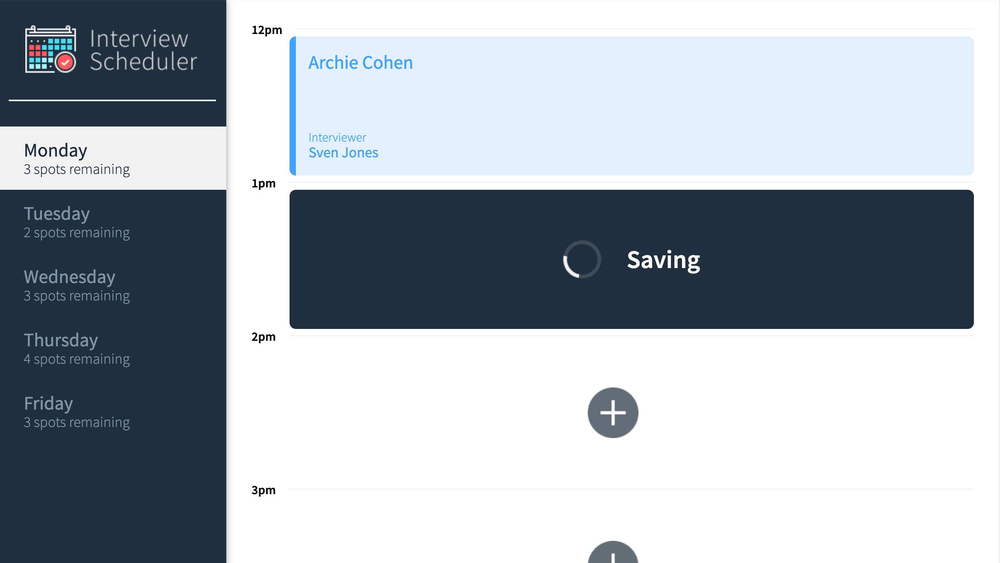
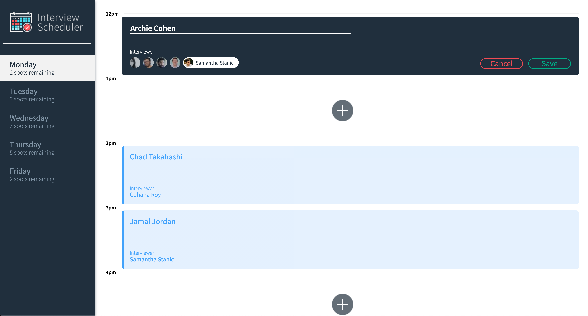
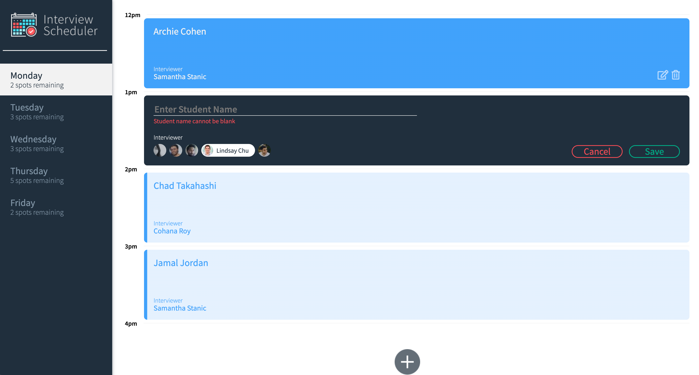
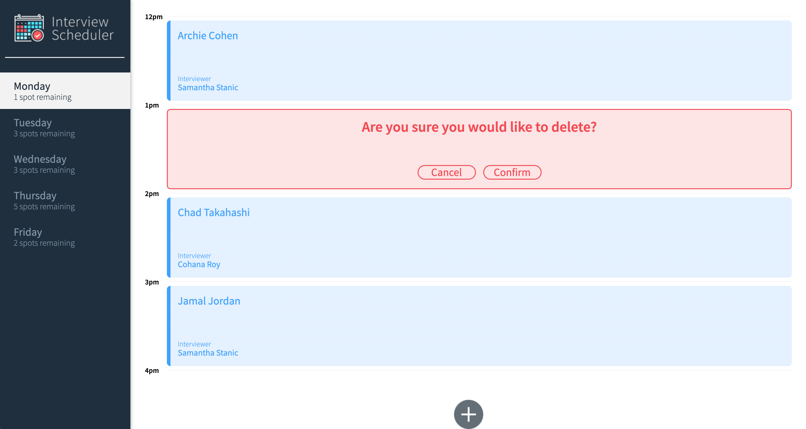
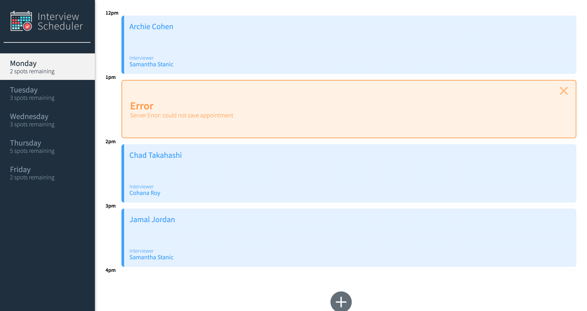

# [Interview Scheduler ](https://scheduler-sdy-lhl.netlify.app/)
[Visit APP and see it in LIVE Action!](https://scheduler-sdy-lhl.netlify.app/)

This project is a Single Page App using React that allows users to book, edit or cancel appointments. It uses API server along with WebSocket to implement a realtime experience. When a user adds/ edits/ cancels an appointment, all clients connected to the server are updated in realtime. Axios and websockets have been used to send and receive requests and updates to and from server. Jest and Cypress are used for Unit, Integration and E2E testing. Storybook has also been used to aid in the  development of react components.

## Final Product

###### Main Page 


###### Add new appointment form


###### Saving Status Indicator


###### Edit appointment form


###### Student Name missing Error


###### Confirmation Dialog before deletion


###### Error Notification


## Setup

Install dependencies with `npm install`.

## Running Webpack Development Server

```sh
npm start
```

## Running Jest Test Framework

```sh
npm test
```

## Running Storybook Visual Testbed

```sh
npm run storybook
```

## Dependencies

- Axios
- classnames
- React
- react-dom
- react-scripts
- Node Sass
- PropTypes